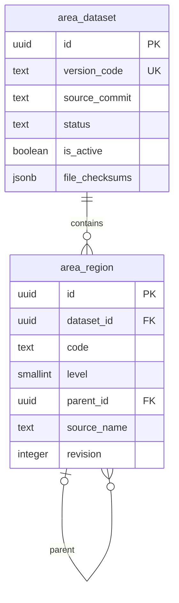

# Database integration

`area-kit` uses one PostgreSQL library with two tables. The host runs the migration explicitly and owns connection pooling, migration bookkeeping, backups, privileges, and any application address table.

```ts
import { areaMigrationSql, createAreaTables } from "area-kit/postgres";

export const sqlForHostMigration = areaMigrationSql("public");
export const tablesForHostQueries = createAreaTables("public");
```

The default library schema is `public`. A custom schema must already exist before the host executes `areaMigrationSql("address_regions")`; use that same `schemaName` for stores, bound transactions, and the Next host. Database CLI commands select it explicitly:

```sh
area-kit import --schema address_regions --dir /srv/area-kit/prepared --report-dir /srv/area-kit/reports/import
area-kit activate --schema address_regions --dataset-id "$AREA_KIT_DATASET_ID"
```

`import --activate` also honors `--schema` for activation. Without this option both commands use `public`. Schema names must match `[a-z][a-z0-9_]{0,62}` and come from trusted host/operator configuration. `AREA_KIT_DATABASE_URL` supplies the connection; HTTP requests cannot select a schema.

## Schema and relationships

`area_dataset` is one immutable source identity plus mutable lifecycle/import metadata. `id` is the dataset identity; `version_code` is unique and stable for the pinned source rules.

| Field | PostgreSQL type | Null/default | Meaning |
| --- | --- | --- | --- |
| `id` | `uuid` | primary key, `gen_random_uuid()` | dataset identity |
| `version_code`, `source`, `source_commit`, `rules_version`, `code_scheme` | `text` | not null | source identity and parsing rules |
| `data_as_of`, `source_published_at` | `date` | not null | source dates |
| `file_checksums`, `coverage` | `jsonb` | not null | input manifest and coverage |
| `level_counts` | `jsonb` | not null, `{}` | counts by level |
| `status` | `text` | not null, `importing` | lifecycle state |
| `is_active` | `boolean` | not null, `false` | selected read snapshot |
| `import_progress`, `import_report` | `jsonb` | not null, `{}` | bounded progress and audit result |
| `imported_at` | `timestamptz` | nullable | set exactly for ready data |
| `created_at`, `updated_at` | `timestamptz` | not null, `now()` | row timestamps |

`area_region` belongs to one dataset and keeps the original code/name plus host presentation state.

| Field | PostgreSQL type | Null/default | Meaning |
| --- | --- | --- | --- |
| `id` | `uuid` | primary key, `gen_random_uuid()` | node identity |
| `dataset_id` | `uuid` | not null | owning snapshot |
| `code`, `source_name` | `text` | not null | untouched source fields |
| `level` | `smallint` | not null | level 1 through 5 |
| `parent_id` | `uuid` | nullable | same-dataset direct parent; null only at level 1 |
| `node_kind` | `text` | not null | `region`, `group`, `statisticalUnit`, or `unknown` |
| `display_name` | `text` | nullable | host override; null uses source name |
| `sort` | `integer` | not null, `0` | host ordering |
| `enabled` | `boolean` | not null, `true` | host availability |
| `revision` | `integer` | not null, `1` | optimistic-write revision |
| `created_at`, `updated_at` | `timestamptz` | not null, `now()` | row timestamps |



## Source-to-schema mapping

The importer retains the source code and name exactly and derives the `parent_id` from the source ancestor columns. It does not infer parentage from code prefixes or names.

| Source CSV | Level | Source columns used for ancestry | Persisted mapping |
| --- | ---: | --- | --- |
| `provinces.csv` | 1 | `code`, `name` | root `area_region` |
| `cities.csv` | 2 | `provinceCode`, `code`, `name` | parent province |
| `areas.csv` | 3 | `provinceCode`, `cityCode`, `code`, `name` | parent city |
| `streets.csv` | 4 | `provinceCode`, `cityCode`, `areaCode`, `code`, `name` | parent county/district |
| `villages.csv` | 5 | `provinceCode`, `cityCode`, `areaCode`, `streetCode`, `code`, `name` | parent township/street |

The only navigation-group classification is fixed, source-and-commit-specific evidence for nine level-2 tuples (`1101`, `1201`, `3101`, `5001`, `5002`, `4190`, `4290`, `4690`, `6590`). Other special-looking names remain `unknown`; a name alone never establishes administrative meaning. `versionCode` is the stable source identity `modood-administrative-divisions-of-china:c49d495b40ac73eb1a66f6eeae5f8fd10696f035:v1`, not a statement that the data is current.

Store address snapshots in host-owned records as `datasetId`, `versionCode`, validated endpoint `code`, and the returned `pathCodes`/`pathNames`. These snapshots preserve historical presentation even when a later dataset becomes active. Do not overwrite old addresses during activation; resolve them against their saved dataset when it remains available.

## Constraints and indexes

`area_dataset` has primary key `area_dataset_pkey`, unique `area_dataset_version_code`, and partial unique index `area_dataset_one_active` on a constant where `is_active`. Its checks are `area_dataset_status` (`importing`, `ready`, or `failed`), `area_dataset_active_ready` (an active row is ready), and `area_dataset_imported_ready` (ready status is equivalent to non-null `imported_at`).

`area_region` has primary key `area_region_pkey`; unique `area_region_dataset_id_pair` on `(dataset_id, id)`; and unique `area_region_dataset_code` on `(dataset_id, code)`. `area_region_dataset` references `area_dataset(id)` with `ON DELETE RESTRICT`. `area_region_same_dataset_parent` references `(dataset_id, id)` on `area_region`, also `ON DELETE RESTRICT`, preventing cross-dataset parents.

Its checks are `area_region_level` (1 through 5), `area_region_revision` (greater than zero), `area_region_code_nonblank` and `area_region_source_name_nonblank` (each matches `[^[:space:]]`), `area_region_node_kind` (the four values above), and `area_region_root` (level 1 has null parent; lower levels have non-null parent). Index `area_region_parent_sort_code` is `(dataset_id, parent_id, sort, code)` and `area_region_level_sort_code` is `(dataset_id, level, sort, code)`.

## Transaction and cache responsibilities

Import writes a full dataset, re-audits it, and marks it ready only after verification; activation chooses the one ready active dataset. `updatePresentation` checks the caller's `admin.write` authorization and exact revision inside a write transaction. The host must invalidate cache entries for every process after a successful presentation change. The package owns neither external caches nor host address writes.


## Packed database acceptance

On 2026-09-17, the installed tarball's migration and CLI initialized a fresh PostgreSQL 18.3 database with all 665,276 pinned source rows, then activated the ready dataset. A React-free Node consumer and the production Next example queried that same real database, including paths, same-name search, targets 1–5, and source navigation-group rules. Before initialization, the live Next adapter returned 503 for an authorized uninitialized read and 403 for an unauthenticated request.

Browser business submissions used the example's same-connection validation/persistence transaction with a test-only host persistence implementation; the verifier checked persisted records in PostgreSQL. Administrative label saves, disable/restore, and pagination passed at desktop and narrow widths. Queries and business writes also passed after restarting Node/Next under the process-level offline guard. These results do not supply production credentials, authentication, business tables, migration orchestration, or cache invalidation for the host.


### Acceptance evidence scope after subsequent fixes

The full nationwide-database, Chrome UI, and offline results above belong to the Task 18 runtime artifact with SHA-256 `5392a2cfabb025ef410d5063beaa5756be0a588b6c7254f3b8357d2bd673a12f` and its documentation-only successor `2013198e001fc04ab959308bf8b3f385263996fcb9fddf5404c09d2bab9d5249`. Later fixes changed controlled selection, manager request races, display-label handling, and custom-schema CLI routing. Those historical full-run results must not be read as full browser/offline acceptance of later package bytes. Current-package installation, type, boundary, and focused regression results are recorded separately by maintainers; the nationwide import/performance and complete browser/offline runs have not been repeated after those fixes.
